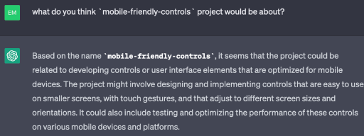

# mobile-friendly-controls

Base for developing mobile friendly PWAs `pwa-base`, `pwa-essentials`, `universal-controls`

Main feats: 
- fullscreen mode, mobile installation
- mobile UI design elements
- touch device controls

Demos:
- GameControls (as used in `three-mobile-fps-demo`)
- RovControls (as used in `mobile-rov-controls`)

From `chatgpt` own guess:

## Usage
- install deps : `yarn`

- use for local dev: `yarn parcel src/index.html`

- build for static serve: `yarn parcel build src/index.html`

- build lib for use in other project: `yarn parcel build src/index.html`

## Code
Touch controls are split in two parts:
- logic side: `controls/TouchControls.ts`
- UI side: `ui/TouchControls.tsx` (react based implementation)
